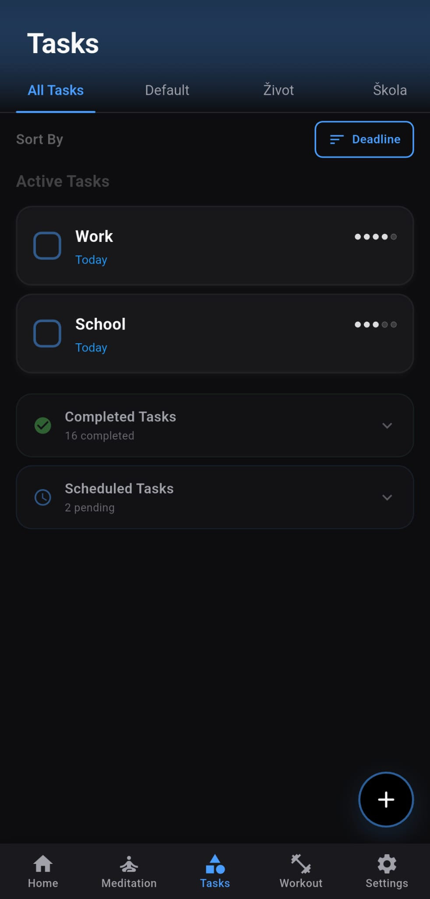
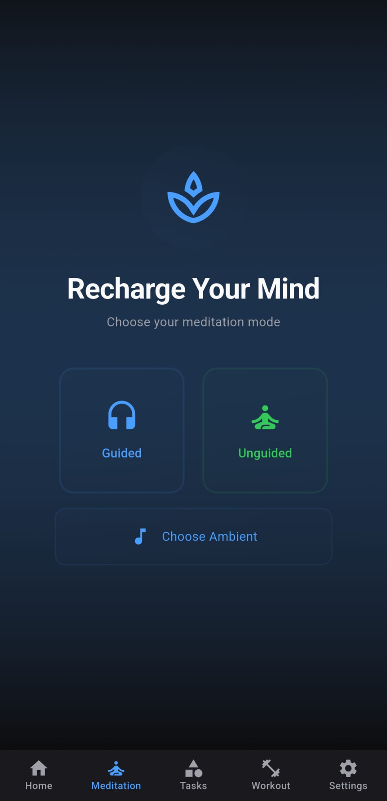
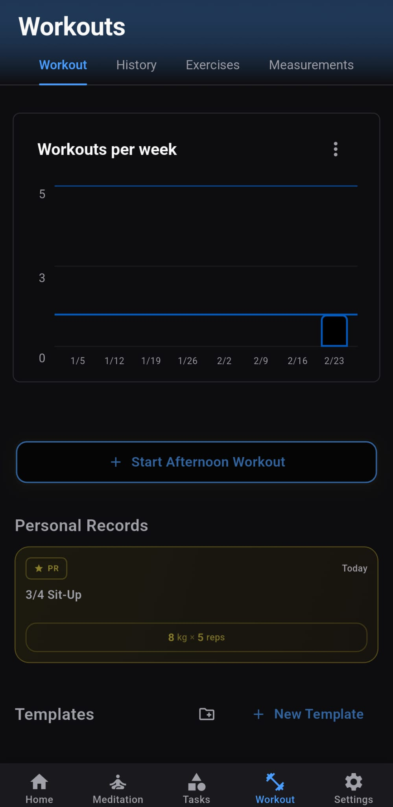
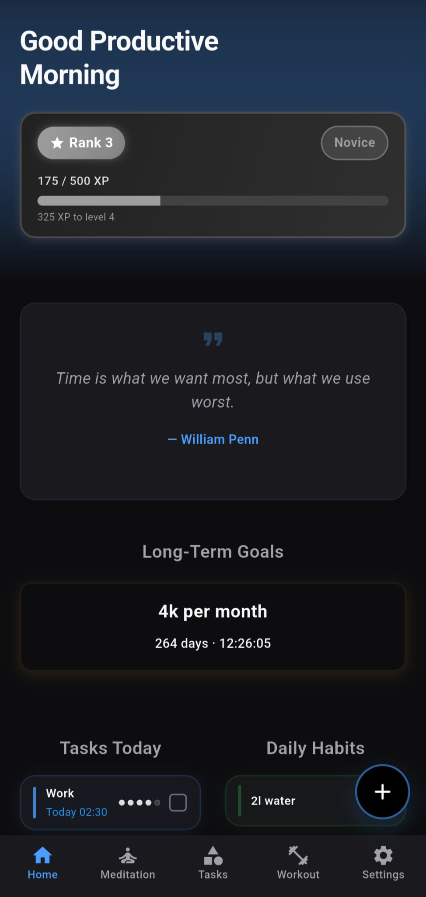

# Mental Warrior

> A self-improvement Flutter app built around discipline, consistency, and gamified personal growth.

Mental Warrior helps you track workouts, meditate, read, manage tasks, and level up your life — all backed by a local SQLite database and a rewarding XP system.

---

## Screenshots

<p align="center">
  
  
  
  
</p>
<p align="center">
  <sub>Home &nbsp;&nbsp;&nbsp;&nbsp; Tasks &nbsp;&nbsp;&nbsp;&nbsp; Meditation &nbsp;&nbsp;&nbsp;&nbsp; Workout &nbsp;&nbsp;&nbsp;&nbsp; Measurements</sub>
</p>

---

## Features

- **Workout Tracking** — Log exercises, create custom workouts & templates, track sets/reps, rest timers, and supersets
- **Barbell Plate Calculator** — Quickly calculate plate loadouts for any weight
- **Meditation Sessions** — Guided timers with ambient audio (rain, forest, campfire, waves, drone)
- **Task & Goal Management** — Track daily tasks, long-term goals, and habits
- **Book Tracker** — Log and monitor your reading progress
- **Body Measurements** — Track weight, body metrics, and progress over time
- **XP & Level System** — Earn XP for completing activities and level up
- **Progress Charts** — Visualize weekly workout history and other stats
- **Background Services** — Active workout bar, foreground task, alarm manager
- **Local Notifications & Reminders** — Scheduled alerts without internet dependency
- **Fully Offline** — All data stored locally with SQLite

---

## Tech Stack

| Layer | Technology |
|---|---|
| Framework | Flutter 3.x / Dart SDK ^3.6.0 |
| Database | SQLite via `sqflite` |
| State Management | `provider` |
| Audio | `audioplayers`, `just_audio` |
| Background | `flutter_foreground_task`, `android_alarm_manager_plus`, `wakelock_plus` |
| Notifications | `flutter_local_notifications` |
| Charts | `fl_chart` |
| Animations | `flutter_animate` |
| Storage | `shared_preferences`, `path_provider` |
| Utilities | `crypto`, `http`, `permission_handler`, `share_plus`, `vibration` |

---

## Project Structure

```
lib/
├── main.dart
├── data/
│   └── exercises_data.dart          # Static exercise definitions
├── models/
│   ├── books.dart
│   ├── categories.dart
│   ├── goals.dart
│   ├── habits.dart
│   ├── tasks.dart
│   ├── user_xp.dart
│   └── workouts.dart
├── pages/
│   ├── home.dart
│   ├── meditation.dart
│   ├── meditation_coundown.dart
│   ├── categories_page.dart
│   ├── settings_page.dart
│   ├── splash_screen.dart
│   ├── welcome_splash_screen.dart
│   ├── username_input_screen.dart
│   ├── metrics_setup_screen.dart
│   ├── exercise_selection_page.dart
│   └── workout/
│       ├── workout_page.dart
│       ├── workout_session_page.dart
│       ├── workout_completion_page.dart
│       ├── workout_details_page.dart
│       ├── workout_edit_page.dart
│       ├── workout_settings_page.dart
│       ├── template_editor_page.dart
│       ├── exercise_browse_page.dart
│       ├── exercise_detail_page.dart
│       ├── exercise_selection_page.dart
│       ├── create_exercise_page.dart
│       ├── edit_exercise_page.dart
│       ├── custom_exercise_detail_page.dart
│       ├── hidden_exercises_page.dart
│       ├── superset_selection_page.dart
│       ├── rest_timer_page.dart
│       └── body_measurements_page.dart
├── services/
│   ├── database_services.dart       # SQLite operations
│   ├── user_preferences.dart        # SharedPreferences wrapper
│   ├── meditation_engine.dart       # Meditation session logic
│   ├── audio_cache.dart             # Audio file caching
│   ├── foreground_service.dart      # Persistent foreground task
│   ├── background_task_manager.dart
│   ├── notification_service.dart
│   ├── reminder_service.dart
│   ├── tts_service.dart             # Text-to-speech
│   ├── quote_service.dart
│   ├── book_service.dart
│   ├── plate_bar_customization_service.dart
│   └── hash_utils.dart
├── utils/
│   ├── app_theme.dart               # Global theme & colors
│   ├── functions.dart
│   ├── page_transitions.dart
│   └── performance_utils.dart
└── widgets/
    ├── active_workout_bar.dart
    ├── barbell_plate_calculator.dart
    ├── workout_week_chart.dart
    ├── xp_bar.dart
    ├── xp_gain_bubble.dart
    ├── level_up_animation.dart
    └── smooth_loading.dart
```

---

## Getting Started

### Prerequisites

- [Flutter SDK](https://docs.flutter.dev/get-started/install) ^3.6.0
- Android Studio or Xcode (for device/emulator)

### 1. Clone the repository

```bash
git clone https://github.com/your-username/mental_warior.git
cd mental_warior
```

### 2. Install dependencies

```bash
flutter pub get
```

### 3. Run the app

```bash
flutter run
```

### 4. Build for release (Android)

```bash
flutter build apk --release
```

---

## Permissions (Android)

The app requests the following permissions at runtime:

- `SCHEDULE_EXACT_ALARM` — For workout reminders
- `FOREGROUND_SERVICE` — Active workout background service
- `WAKE_LOCK` — Keep screen on during workouts
- `VIBRATE` — Haptic feedback
- `POST_NOTIFICATIONS` — Local notifications (Android 13+)

---

## Contributing

Pull requests are welcome. For major changes, please open an issue first to discuss what you would like to change.

---

## License

This project is licensed under the MIT License.
